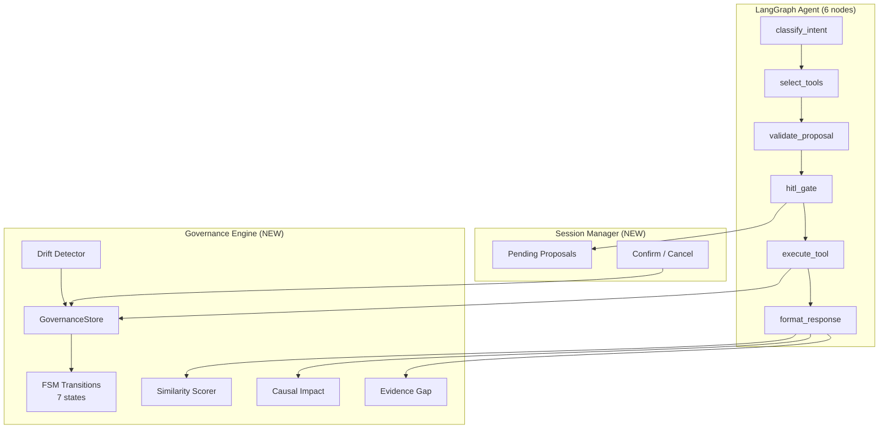

# Governance Engine Feature Spec

## Owner: OMH-GSA (Guna) — coordinated across team
## Phase: 2 (Day 6–7, April 22–23)
## Issues: [#60](https://github.com/GunaPalanivel/openmetadata-mcp-agent/issues/60), [#61](https://github.com/GunaPalanivel/openmetadata-mcp-agent/issues/61), [#62](https://github.com/GunaPalanivel/openmetadata-mcp-agent/issues/62), [#63](https://github.com/GunaPalanivel/openmetadata-mcp-agent/issues/63), [#64](https://github.com/GunaPalanivel/openmetadata-mcp-agent/issues/64), [#65](https://github.com/GunaPalanivel/openmetadata-mcp-agent/issues/65), [#66](https://github.com/GunaPalanivel/openmetadata-mcp-agent/issues/66)

---

## Overview

Transform the agent from a stateless chatbot into a **governance engine** with lifecycle state management, drift detection, learning governance, causal explainability, and epistemic humility.

This is a 7-sub-phase upgrade comprising 6 new services and documentation updates. Each sub-phase builds on the previous.

---

## Architecture Diagram



## Governance State Machine

```
UNKNOWN ──→ SCANNED ──→ SUGGESTED ──→ APPROVED ──→ ENFORCED
                │              │            │             │
                └── UNKNOWN    └── SCANNED  └── DRIFT ←──┘
                                            DETECTED
                                               │
                                               ├──→ REMEDIATED ──→ ENFORCED
                                               └──→ SUGGESTED
```

### States

| State | Description | Entry Condition |
|-------|-------------|-----------------|
| `unknown` | Entity seen but never processed | Initial state |
| `scanned` | Entity inspected by agent | After `get_entity_details` or `search_metadata` returns entity |
| `suggested` | LLM proposed tags, awaiting HITL | After classification produces suggestions |
| `approved` | Human confirmed, tags applied | After `POST /chat/confirm` with `accepted=true` |
| `enforced` | Downstream propagation verified | After drift scan confirms tags still present |
| `drift_detected` | Post-approval change detected | Lineage hash changed OR tags removed |
| `remediated` | Drift resolved | After re-approval or automatic fix |

### Transition Rules

Only these transitions are allowed (FSM-enforced, not ad-hoc):

| From | To |
|------|-----|
| `unknown` | `scanned` |
| `scanned` | `suggested`, `unknown` |
| `suggested` | `approved`, `scanned` |
| `approved` | `enforced`, `drift_detected` |
| `enforced` | `drift_detected` |
| `drift_detected` | `remediated`, `suggested` |
| `remediated` | `enforced` |

---

## Sub-Phase Details

### GOV-01: Governance State Machine (#60) — @GunaPalanivel

**Files:**
- `src/copilot/models/governance_state.py` (NEW)
- `src/copilot/services/governance_store.py` (NEW)
- `src/copilot/models/__init__.py` (MODIFY)
- `src/copilot/middleware/error_envelope.py` (MODIFY)
- `tests/unit/test_governance_state.py` (NEW)
- `tests/unit/test_governance_store.py` (NEW)

**Score Δ: +12 pts** — Judges see FSM-enforced governance, not ad-hoc scripts.

---

### GOV-02: Session Manager (#61) — @GunaPalanivel

**Files:**
- `src/copilot/services/sessions.py` (NEW)
- `src/copilot/api/chat.py` (MODIFY)
- `src/copilot/services/agent.py` (MODIFY)
- `tests/unit/test_sessions.py` (NEW)

**Score Δ: +15 pts** — HITL flow completes end-to-end.

---

### GOV-03: Drift Detection (#62) — @PriyankaSen0902

**Files:**
- `src/copilot/services/drift.py` (NEW)
- `src/copilot/services/agent.py` (MODIFY)
- `src/copilot/api/main.py` (MODIFY)
- `tests/unit/test_drift.py` (NEW)

**Demo moment:** Approve PII tags → manually delete tag in OM → within 10 min the agent surfaces `DRIFT_DETECTED`.

**Score Δ: +8 pts**

---

### GOV-04: Similarity Scoring (#63) — @PriyankaSen0902

**Files:**
- `src/copilot/services/similarity.py` (NEW)
- `src/copilot/services/agent.py` (MODIFY)
- `tests/unit/test_similarity.py` (NEW)

**Demo moment:** Agent says "This table matches 4/5 PII signals we previously approved in `orders.customers` (conf: 0.87). Auto-approval recommended."

**Score Δ: +7 pts**

---

### GOV-05: Causal Impact (#64) — @aravindsai003

**Files:**
- `src/copilot/services/impact.py` (NEW)
- `src/copilot/services/agent.py` (MODIFY)
- `tests/unit/test_impact.py` (NEW)

**Demo moment:** "If NOT tagged, 14 downstream assets (3 Tier-1) are at risk."

**Score Δ: +5 pts**

---

### GOV-06: Epistemic Humility (#65) — @aravindsai003

**Files:**
- `src/copilot/services/agent.py` (MODIFY)

**Demo moment:** "I don't have enough evidence to classify `X`. Recommended: create a glossary term."

**Score Δ: +3 pts**

---

### GOV-07: Documentation (#66) — @5009226-bhawikakumari

**Files:**
- `README.md` (MODIFY)
- `docs/architecture.md` (MODIFY)
- `docs/api.md` (MODIFY)
- `CHANGELOG.md` (MODIFY)
- `.idea/Plan/*` (MODIFY)

---

## Execution Order

```
GOV-01 (FSM) → GOV-02 (Sessions) → GOV-03 (Drift) → GOV-04 (Similarity) → GOV-05 (Impact) → GOV-06 (Epistemic) → GOV-07 (Docs)
```

Each sub-phase builds on the previous. GOV-01 is the foundation for all others.

## Test Strategy

- Each sub-phase adds unit tests with mocked MCP calls
- No integration tests required (mock OM responses)
- Target: all existing tests still pass + new tests green
- Coverage target: >70% on `src/copilot/`

## Dependencies

- Upstream merge (#56, #57, #58) ← **DONE** (April 22, 2026)
- `POST /chat` wired ← **DONE** (PR #58)
- Typed MCP wrappers ← **DONE** (PR #57)
- 52 seed tables ← **DONE** (PR #56)
