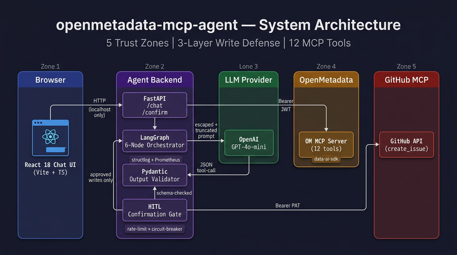
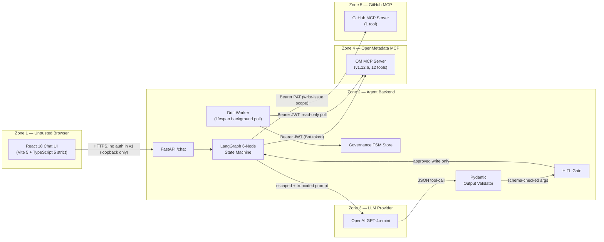
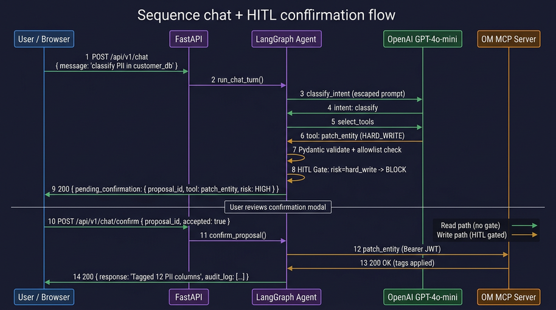
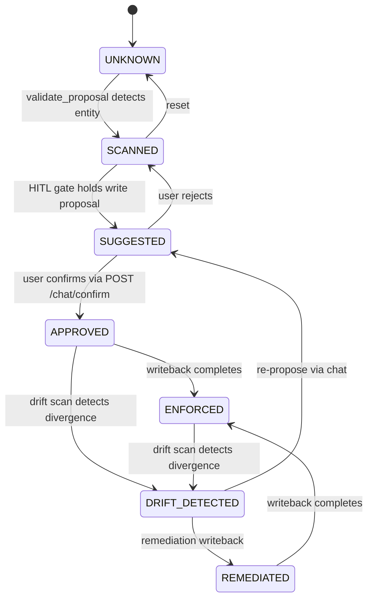

# Architecture

> **Status: Hackathon Complete** — 333 tests passing, 87% coverage.



## System context



## Trust zones and write defense

**Five trust zones** with three independent gates between LLM output and any catalog write:

| # | Defense layer | Where |
|---|---|---|
| 1 | Pydantic schema validation | `ToolCallProposal.model_validate` rejects malformed tool-call JSON |
| 2 | Server-side tool allowlist | `services/agent.py::ALLOWED_TOOLS` (frozen set of 13 `ToolName` values) |
| 3 | Human-in-the-loop confirmation | `POST /api/v1/chat/confirm` — writes are held in a session store with 5-minute TTL |

## Layered package structure

```
src/copilot/
├── api/             HTTP layer ONLY: routing, request parsing, response shaping
├── services/        Business logic: orchestration, classification, drift, governance FSM
├── clients/         External system clients: data-ai-sdk (OM), openai, github_mcp
├── models/          Pydantic v2 models: chat session, tool proposals, governance state
├── middleware/      request_id, rate-limit, error envelope
├── config/          Pydantic Settings, env loading
└── observability/   structlog (JSON) + prometheus + redaction processor
```

Layer rules (enforced by `tests/architecture/test_layer_imports.py`):

- `api/` may call `services/`. Never `clients/`.
- `services/` may call `clients/` and `models/`. Never raises HTTP types.
- `clients/` are the only place external SDK calls happen.

See [`CodePatterns.md`](../CodePatterns.md) section 7 (Method/function size) and section 9 (No code duplication) for the per-function bar.

## Data flow (chat request)



The agent is a 6-node LangGraph state machine compiled once at startup and reused across requests:

```
[POST /api/v1/chat with user_message]
  → RequestIdMiddleware: bind UUID to structlog.contextvars
  → Rate limiter (slowapi): 30 req/min per IP
  → ChatRequest (Pydantic validation)
  → services.agent.run_chat_turn()
       → LangGraph state machine (6 nodes):

            ┌──────────────────┐
            │  classify_intent │  Node 1: LLM classifies intent
            └────────┬─────────┘  (search|classify|lineage|rca|glossary|metric|test|multi_mcp)
                     │
            ┌────────▼─────────┐
            │   select_tools   │  Node 2: deterministic fast-path or LLM fallback
            └────────┬─────────┘  picks tools from the 13-tool allowlist
                     │
            ┌────────▼─────────┐
            │validate_proposal │  Node 3: Pydantic ToolCallProposal.model_validate
            └────────┬─────────┘  + allowlist assertion + risk_level assignment
                     │
            ┌────────▼─────────┐
            │    hitl_gate     │  Node 4: reads pass through; writes held as
            └───┬──────────┬───┘  session.pending_confirmation (5-min TTL)
                │          │
          (reads only)  (writes → return 200 with confirmation_required)
                │
            ┌───▼──────────────┐
            │   execute_tool   │  Node 5: call OM MCP or GitHub MCP via asyncio.to_thread
            └────────┬─────────┘
                     │
            ┌────────▼─────────┐
            │ format_response  │  Node 6: LLM composes Markdown answer from results
            └──────────────────┘

  → 200 response: {request_id, session_id, response, audit_log[], tokens_used, ts}

[POST /api/v1/chat/confirm with proposal_id + accepted]
  → session store lookup → TTL check
  → if accepted: governance FSM transition → enqueue writeback
  → if rejected: append rejection record
```

## Tool inventory

13 tools total across two MCP servers:

| # | Tool | Server | Risk | Description |
|---|---|---|---|---|
| 1 | `search_metadata` | OM MCP | read | Full-text search across entities |
| 2 | `semantic_search` | OM MCP | read | Vector/semantic search |
| 3 | `get_entity_details` | OM MCP | read | Fetch full entity by FQN |
| 4 | `get_entity_lineage` | OM MCP | read | Upstream/downstream lineage |
| 5 | `get_test_definitions` | OM MCP | read | List data quality test types |
| 6 | `root_cause_analysis` | OM MCP | read | DQ failure root cause analysis |
| 7 | `create_glossary` | OM MCP | soft_write | Create a new glossary |
| 8 | `create_glossary_term` | OM MCP | soft_write | Add a term to a glossary |
| 9 | `create_lineage` | OM MCP | soft_write | Add a lineage edge |
| 10 | `create_test_case` | OM MCP | soft_write | Create a DQ test |
| 11 | `create_metric` | OM MCP | soft_write | Create a metric definition |
| 12 | `patch_entity` | OM MCP | hard_write | Modify entity (tags, owner, desc) |
| 13 | `github_create_issue` | GitHub MCP | soft_write | Create a GitHub issue |

## Authentication

| Segment | Browser → FastAPI | FastAPI → OM MCP (v1.12.6) | FastAPI → OpenAI | FastAPI → GitHub MCP |
|---------|-------------------|----------------------------|-------------------|----------------------|
| v1 (hackathon) | None (loopback only) | Bot JWT (`AI_SDK_TOKEN`) | API key (`OPENAI_API_KEY`) | PAT (`GITHUB_TOKEN`) |
| v2 (roadmap) | OM OAuth callback | Per-user JWT (impersonation) | Same | Same |

## Observability

Every request gets a UUID `request_id` propagated end-to-end:

- `structlog` binds it to `contextvars` so every log line in the same request includes it
- `RequestIdMiddleware` sets `X-Request-Id` on the response
- Prometheus metrics include the same data dimensions per `GET /api/v1/metrics`

The 4 Golden Signals + token usage + circuit-breaker state are exposed at `/api/v1/metrics`. See [`docs/api.md`](api.md) for the full series list.

## Resilience

Every external call has timeout + retry (tenacity, exponential backoff with jitter) + circuit breaker (pybreaker) + rate limit (slowapi):

| Call | Timeout | Retries | Circuit breaker |
|------|---------|---------|-----------------|
| OpenMetadata MCP | 5.0 s | 3 × exp backoff + jitter | open after 5 failures, 30 s cooldown |
| OpenAI | 8.0 s | 2 × exp backoff + jitter | open after 5 failures, 60 s cooldown |
| GitHub MCP | 5.0 s | 2 × exp backoff + jitter | open after 3 failures, 60 s cooldown |

When a circuit opens, the response is a structured error envelope (`om_unavailable` / `llm_unavailable` / `github_unavailable`). The chat UI shows a clear message rather than crashing.

## Drift detection

A background polling loop runs inside the FastAPI lifespan and continuously monitors catalog entities for governance drift:

```
┌──────────────────────────────────────────────────┐
│                  FastAPI lifespan                 │
│                                                  │
│   asyncio.create_task(_drift_poll_loop)          │
│       │                                          │
│       ├─► run_drift_scan()                       │
│       │     ├─ search_metadata(query="*")        │
│       │     ├─ get_entity_details(fqn) per hit   │
│       │     ├─ SHA-256 hash of (desc+cols+tags)  │
│       │     ├─ compare to in-memory baseline     │
│       │     └─ emit DriftItem per divergence     │
│       │                                          │
│       └─► sleep(drift_poll_interval_seconds)     │
│           (default 60s, configurable via env)    │
└──────────────────────────────────────────────────┘
```

Three drift signals:

| Signal | Trigger |
|--------|---------|
| `hash_changed` | SHA-256 of governance-relevant fields differs from baseline |
| `tag_missing` | A governance tag (PII.\*, Tier.\*, PersonalData.\*) was removed |
| `tag_unexpected` | A governance tag appeared that was not in the baseline |

The latest scan results are cached in memory and exposed via `GET /api/v1/governance/drift`. The drift worker catches all exceptions internally and never crashes the process (NFR-03).

## Governance state machine

Each catalog entity (identified by FQN) has a governance lifecycle tracked by the `GovernanceState` FSM:



Seven states with strict transition edges enforced by `GovernanceState` + `ALLOWED_TRANSITIONS` in `models/governance_state.py`. Invalid transitions raise `GovernanceTransitionError`.

| State | Meaning |
|-------|---------|
| `UNKNOWN` | Entity discovered, no governance action taken |
| `SCANNED` | Agent validated a tool proposal referencing this entity |
| `SUGGESTED` | Write proposal pending human confirmation |
| `APPROVED` | Human confirmed the write via HITL gate |
| `ENFORCED` | Writeback completed against OM |
| `DRIFT_DETECTED` | Background scan found divergence from approved baseline |
| `REMEDIATED` | Drift resolved via writeback |

## Frontend

React 18 + Vite 5 + TypeScript 5 (strict mode, no `any`, no MUI). Located in `ui/`.

Key components:

- **Chat panel** — sends `POST /chat` and renders Markdown responses with audit log
- **HITL confirmation modal** — surfaces pending write proposals with approve/reject controls
- **Drift dashboard sidebar** — displays the latest `DriftSnapshot` from `GET /governance/drift`

Playwright E2E suite (3 specs):

| Spec | Coverage |
|------|----------|
| `chat-round-trip` | Full chat → tool execution → response render |
| `hitl-modal` | Write proposal → modal → confirm/reject flow |
| `moment-3-injection` | Prompt injection neutralization (Moment 3 defense) |

## Internal planning docs

Most of `.idea/Plan/` is published in this repo. Highlights:

- [`.idea/Plan/Architecture/Overview.md`](../.idea/Plan/Architecture/Overview.md) — Internal architecture overview
- [`.idea/Plan/Architecture/DataModel.md`](../.idea/Plan/Architecture/DataModel.md) — Pydantic shapes
- [`.idea/Plan/Architecture/APIContract.md`](../.idea/Plan/Architecture/APIContract.md) — Full FastAPI surface
- [`.idea/Plan/Security/ThreatModel.md`](../.idea/Plan/Security/ThreatModel.md) — SC-N security claims
- [`.idea/Plan/Security/PromptInjectionMitigation.md`](../.idea/Plan/Security/PromptInjectionMitigation.md) — Module G defense
